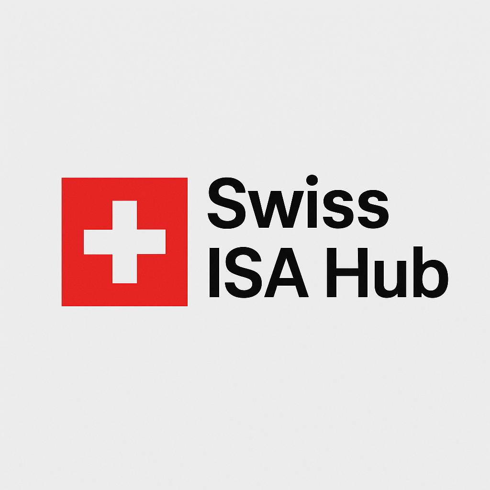

  

---

Disclaimer: Not (yet) officially affiliated with ISA (International Society of Automation).

We want to establish a Swiss section within the global ISA [family of sections](https://www.isa.org/membership/geographic-sections).

A section is a group of professional members who have chosen to affiliate around a specific geographic area. Each section operates as an official ISA affiliate per the charter agreement that defines the relationship between the Society and the section.

## Our Mission

As a community, we aim to:

- Build a neutral platform for networking and collaboration.
- Support local companies in aligning with global ISA/IEC standards.
- Connect Switzerland with the broader ISA Europe and global ISA community.

- 👉 [Become a member](./members) today
- 📅 Next events: tbd
- ✉️ Contacts: [info [at] swissISAhub.ch](mailto:info@swissISAhub.org)

